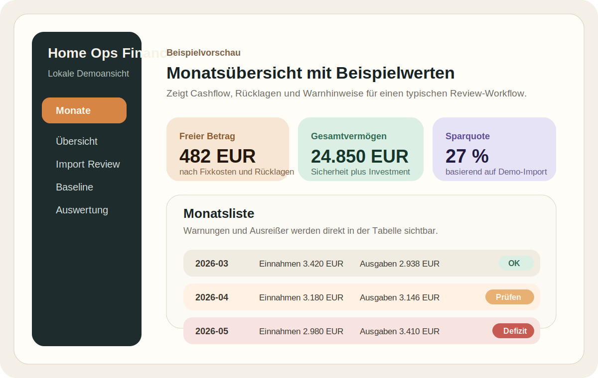
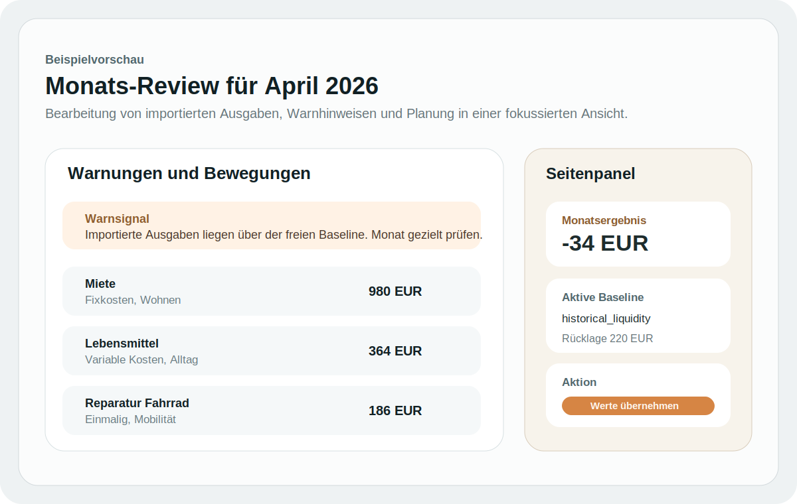

# Home Ops Finance

Local-first finance tracker for migrating spreadsheet-based planning into a more structured app in small, safe steps.

This project is designed to keep private source data outside the repository while still allowing the app, importer, and review workflow to be developed in public.

## Preview

Illustrative preview with sanitized example values:





## Current Direction

The current spreadsheet already combines income, expenses, asset tracking, and monthly rollups. The app should keep that same mental model and move it into a cleaner system instead of forcing a completely different workflow.

## MVP

- Track accounts, assets, income, and expenses.
- Separate fixed and variable monthly costs.
- Show monthly cashflow, savings rate, and net worth.
- Provide a simple 3 to 12 month forecast.

## What Is In The Repo

- TypeScript source for the importer, planning engine, local app server, and browser UI
- sanitized example data for development
- documentation for the workbook migration and target data model
- local-only configuration examples for external private data

## What Is Not In The Repo

- real spreadsheets
- real generated finance reports
- real account data
- local secrets or credentials

## Current Project Files

- `docs/data-model.md`: first draft of the core entities
- `docs/workbook-analysis.md`: reverse-engineered notes from the current spreadsheet
- `docs/import-mapping.md`: sheet-to-table migration plan
- `data/sample-finance.json`: starter shape for real data later
- `config.local.example.json`: local-only example for private workbook/data paths outside the repo
- `src/workbook-importer.ts`: first workbook-to-draft importer scaffold
- `src/types.ts`: target import and domain types
- `TODO.md`: short-term build sequence
- `STATUS.md`: current progress and next step

## Local Commands

```bash
npm install
npm run typecheck
npm test
npm run import:workbook -- "/path/to/private/finance-workbook.xlsx"
npm run bootstrap:mappings
npm run apply:review-state
npm run report:draft -- data/import-draft.json
npm run report:reviewed
npm run plan:months -- data/import-draft.json
npm run plan:reviewed
npm run build:dashboard -- data/draft-report.json data/monthly-plan.json dist/dashboard.html
npm run serve:app
```

Start with `npm install`, then `npm run typecheck` and `npm test`.

## External Private Data

Private workbook and generated JSON data can live outside the repo checkout via a local-only `config.local.json` next to `package.json`.

Example:

```json
{
  "dataDir": "/path/to/private/home-ops-finance/data",
  "workbookPath": "/path/to/private/finance-workbook.xlsx"
}
```

The file is gitignored. You can point it to iCloud, a NAS mount, or another private external path.

All paths shown here are placeholders.

The current importer draft already extracts:

- workbook sheet metadata
- forecast assumptions
- baseline planning anchors
- explicit workbook wealth anchors from `Übersicht Vermögen`
- music income rows
- irregular expense rows
- debt accounts and debt snapshots

The importer also normalizes workbook transaction signs:

- positive irregular rows stay as expenses
- negative irregular rows are converted into imported inflows such as refunds, sales, and payouts

The current monthly engine uses two explicit baseline profiles:

- `historical_liquidity`: before the current investment baseline is active
- `forecast_investing`: from the current investment-oriented planning phase onward

The current monthly engine also:

- keeps music `gross`, `reserve`, and `free` amounts separate
- routes forecast music income between safety and investment buckets after the workbook threshold
- reapplies explicit manual wealth anchors from `Übersicht Vermögen` before continuing the forecast

## Local App

Run `npm run serve:app` and open `http://localhost:4310`.

The local app shell currently serves:

- `/`: browser entry point
- `/data/*`: generated draft and monthly plan JSON from the active private data directory
- `/dist/*`: generated static dashboard output

The browser review currently supports:

- validation signals for likely mismatches or risky months
- month filters for deficits and future forecast rows
- a month-by-month review with active baseline items and imported flows
- local reconciliation and import-correction persistence into project JSON files
- a first reviewed-draft pipeline that can reapply saved corrections once `data/import-draft.json` exists
- bootstrapped default category/account mappings for imported entries
- automatic regeneration of reviewed report, reviewed month plan, and reviewed dashboard after saves in the local app
- a first goals view for milestone tracking and longer-range planning assumptions

## Next Steps

- Turn the spreadsheet categories into the first real data model.
- Add deeper workbook consistency checks against known anchor values and suspicious month totals.
- Expand the review UI from inspection into the first editable finance workflow.
